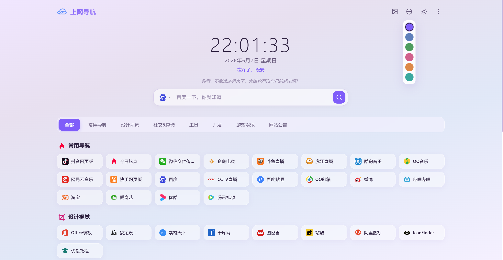
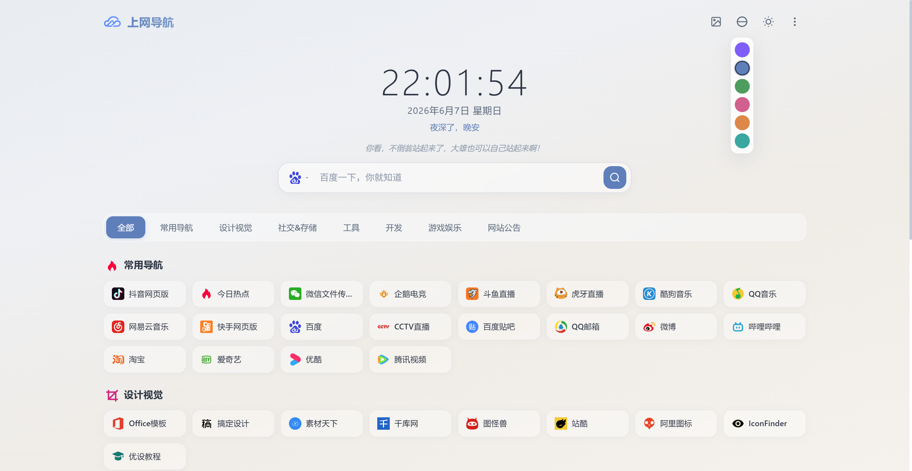
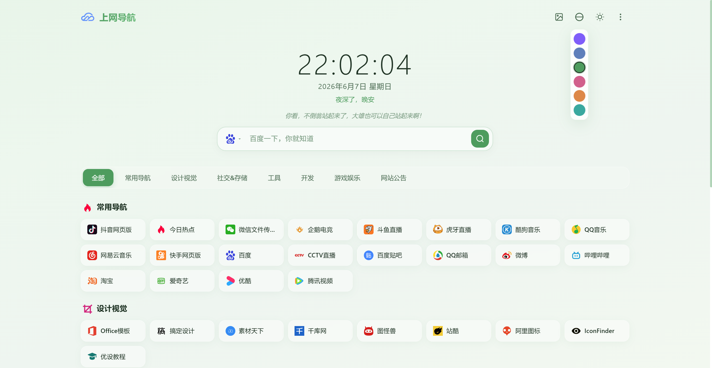
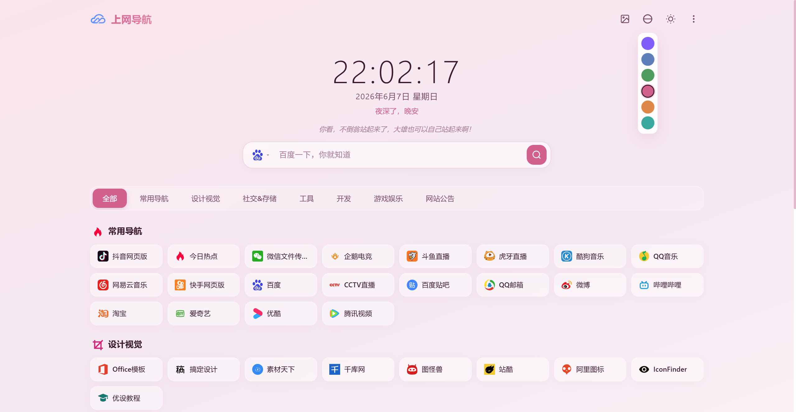
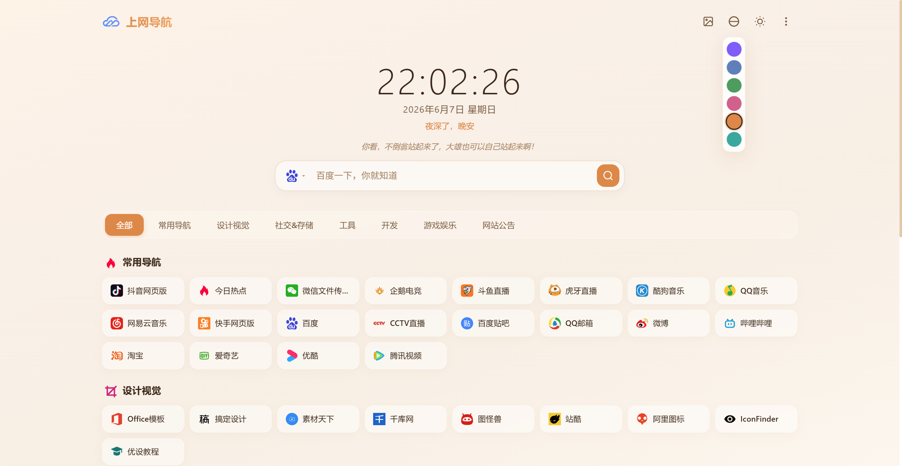
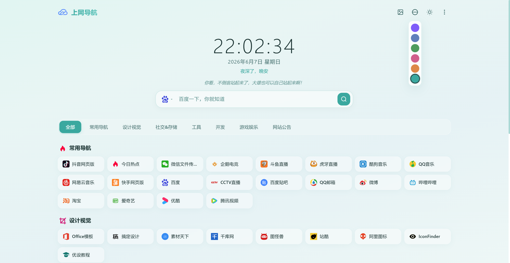
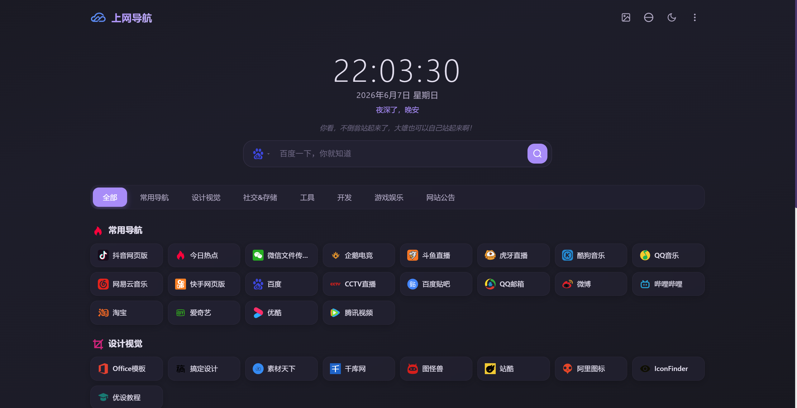
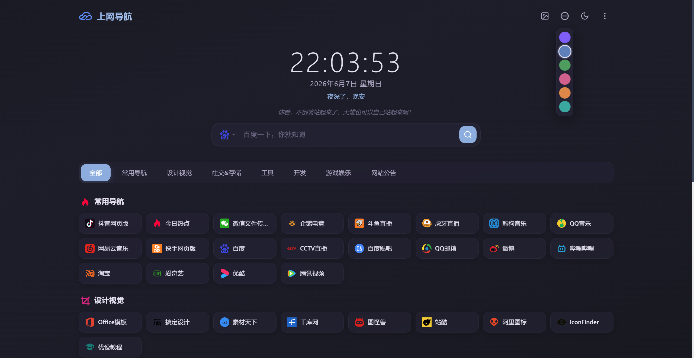
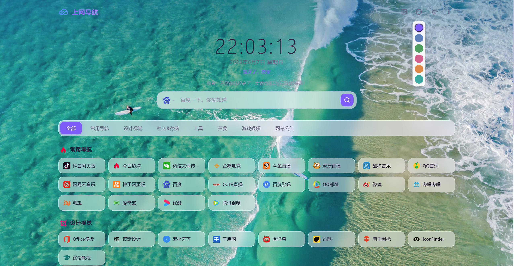
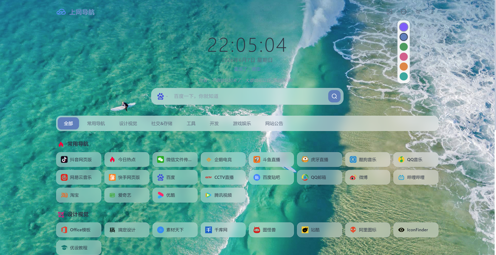

# 六零导航页 Palette（调色板）主题

六零导航页 (LyLme Spage) 的 Palette 主题，毛玻璃质感 + 6 种主题色彩自由切换，一键换色，简约现代风格。

🔗 **在线预览**：[https://nav.litx.cn](https://nav.litx.cn)

## 注意

**该项目为主题模板文件，不支持直接使用，请前往 [LyLme_Spage](https://github.com/LyLme/lylme_spage) 下载安装完整项目源码搭建。**

## 特点

- **🎨 6 色自由切换** — 顶部独立的调色板按钮，极光紫 / 板岩蓝 / 森林绿 / 玫瑰粉 / 日落橙 / 海洋青，一键换色，偏好自动记忆
- **🌙 日间/夜间模式** — 每种色彩都有对应的深色版本，夜间模式与色彩独立运作
- **🪟 毛玻璃质感** — 卡片和导航栏使用 CSS `backdrop-filter` 实现通透的磨砂玻璃效果
- **🔍 搜索引擎切换** — 点击搜索框左侧图标即可切换搜索引擎，支持百度搜索建议下拉
- **🖼️ 背景自由切换** — 支持图片背景、视频背景、清除背景，偏好自动记忆
- **📱 全响应式适配** — 网格布局自动适配桌面 / 平板 / 手机（8→6→4→3→2 列）
- **✨ 卡片入场动画** — 链接卡片交错淡入上浮，视觉体验流畅
- **🕐 时钟与问候语** — 根据当前时间显示不同问候语
- **🎯 分类筛选** — 顶部分类导航，点击即可筛选显示对应分类链接
- **🔗 智能链接过滤** — 自动过滤已禁用和密码保护的链接，与后端行为一致

## 色彩方案

| 名称 | 强调色 | 预览 | 风格 |
|------|--------|------|------|
| 极光紫 (Purple) | `#7c5cfc` | 🟣 | 紫蓝渐变，优雅梦幻 |
| 板岩蓝 (Blue) | `#5b7fbd` | 🔵 | 蓝灰暖金，沉稳精致 |
| 森林绿 (Green) | `#4a9c5d` | 🟢 | 自然清新，舒适护眼 |
| 玫瑰粉 (Pink) | `#d4608b` | 🩷 | 温柔浪漫，甜美柔和 |
| 日落橙 (Orange) | `#e08840` | 🟠 | 温暖活力，热情明亮 |
| 海洋青 (Teal) | `#2ea8a0` | 🩵 | 沉稳知性，清爽冷静 |

## 预览图片

### 六种主题色彩


| 极光紫 | 板岩蓝 | 森林绿 |
|--------|--------|--------|
|  |  |  |

| 玫瑰粉 | 日落橙 | 海洋青 |
|--------|--------|--------|
|  |  |  |


### 更多预览


| 夜间-极光紫 | 夜间-板岩蓝 | 背景-极光紫 | 背景-板岩蓝 |
|----------|------------|------------|----------|
|  |  |  |  |


## 安装说明

1. 将 `palette` 文件夹放入 `lylme_spage/template/` 目录下
2. 登录后台 → 主题设置 → 选择 "Palette" → 点击使用

## 使用方法

### 切换色彩

页面顶部栏右侧有一个 **调色板图标**（🌐 地球仪图标），鼠标悬停弹出 6 个彩色圆点，点击即可切换。选择会自动保存到浏览器，刷新不丢失。

### 切换日间/夜间模式

点击调色板右侧的 **太阳/月亮图标** 即可切换。夜间模式为每种色彩提供了对应的深色版本。

### 切换背景

点击 **图片图标** 循环切换背景模式（图片 → 视频 → 清除）；或在「更多」菜单中精确选择。

## 自定义配色

编辑 `css/style.css`，在对应的 `[data-theme="..."]` 选择器中修改 CSS 变量即可调整配色。

例如，修改极光紫的强调色：

```css
[data-theme="purple"] {
    --accent: #7c5cfc;         /* 主色调 */
    --accent-light: #a78bfa;   /* 浅色调 */
    --card-bg: rgba(...);      /* 卡片背景 */
    ...
}
```

夜间模式配色在 `html.night-mode[data-theme="purple"]` 选择器中对应修改。

### 添加自定义色彩

1. 在 `css/style.css` 中添加新的 `[data-theme="yourcolor"]` 变量块
2. 在 `head.php` 的 `.palette-popover` 中添加 `<span class="color-opt" data-color="yourcolor">`
3. 在 `js/script.js` 的 `colors` 数组中添加 `'yourcolor'`

## 文件结构

```
palette/
├── theme.ini          # 主题元信息（名称、版本、作者等）
├── index.php          # 入口文件
├── head.php           # 页面头部、顶栏（含调色板按钮）、搜索框、时钟
├── list.php           # 分类导航条 + 链接列表 + tool_list 数据生成
├── foot.php           # 页脚信息 + JS 引用
├── go.php             # 外部链接安全跳转页
├── css/
│   └── style.css      # 完整样式表（6 色彩 × 2 模式 = 12 套变量）
├── js/
│   ├── script.js      # 时钟、夜间模式、背景切换、色彩切换
│   └── tool.js        # 搜索引擎切换、分类筛选、搜索建议
└── README.md
```

## 浏览器兼容性

- Chrome / Edge 90+
- Firefox 90+
- Safari 15+
- 需要浏览器支持 CSS `backdrop-filter` 和 CSS Grid

## 许可

Apache License 2.0，与六零导航页主项目一致。

## 相关链接

- [六零导航页主项目](https://github.com/LyLme/lylme_spage)
- [Gitee 镜像](https://gitee.com/LyLme/lylme_spage)
- [主题开发文档](http://doc.lylme.com/dev/theme)